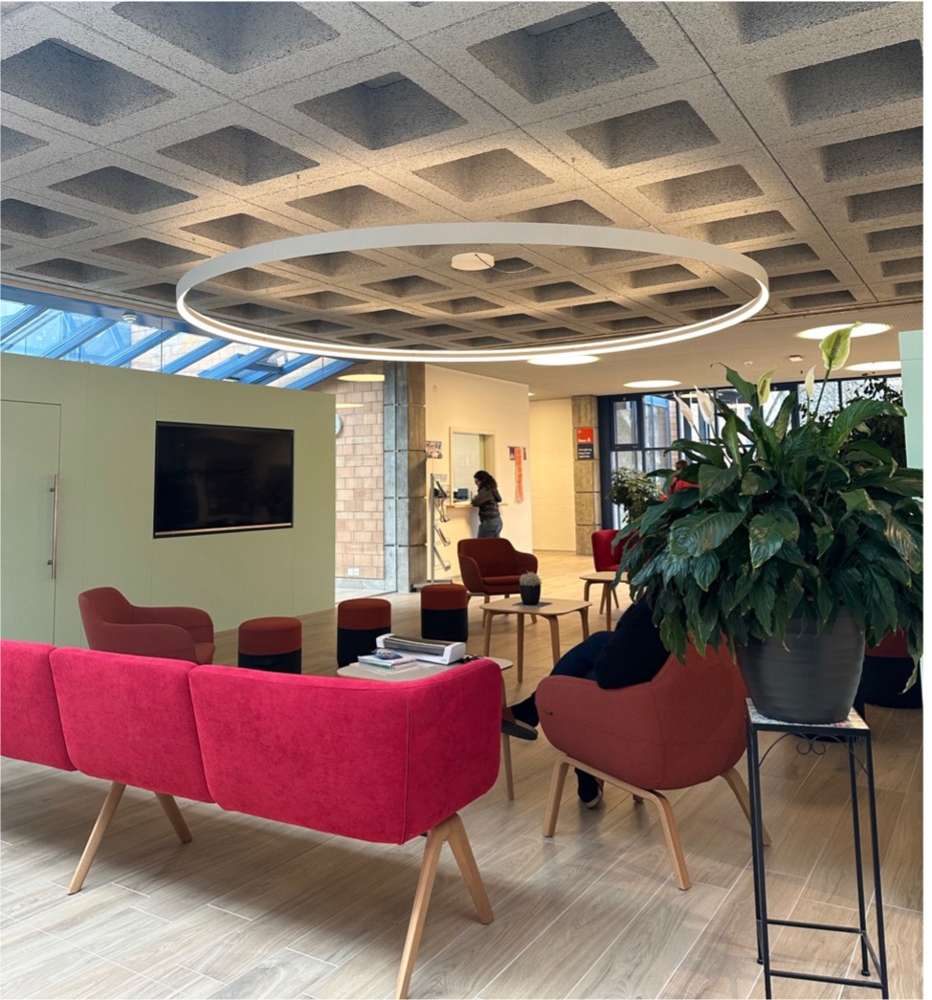

+++
title = "Trisomie"
date = "2024-04-26"
draft = false
pinned = false
+++
# Trisomie 21: Mehr als nur ein genetischer Zustand eine Feier der Individualität



Die genetische Störung bekannt als ,,Down-Syndrom’’ kennt mittlerweile die Mehrheit der Bevölkerung. Jedoch werden die Menschen mit Trisomie 21 oft noch von der Gesellschaft ausgegrenzt. 



*Eine Reportage von Abseera Nanthakumar und Célestine Pfeuti*

Im Aufenthaltsraum des Wohnheims Acherli stehen rote, bequeme Sofas und ein mit Herzen geschmückter Baum für den Valentinstag, es herrscht eine warme Stimmung. Die Frau im Sekretariat teilt mit, dass die Interviewpartnerin gleich kommen solle. Einige Sekunden später treffen Olivier, ein Betreuer im Wohnheim, und Pia, die Interviewpartnerin und zudem Bewohnerin ein. Nach der Begrüssung geht Olivier vor und zeigt den Weg bis zum Aufzug. Im Aufzug sind alle Stöcke mit farbigen Stickern beklebt. Pia drückt auf den 2. Stock mit dem blauen Sticker drauf. ,,Pikettzimmer’’, so ist das Zimmer angeschrieben, bei dem Olivier die Tür offenhält.

