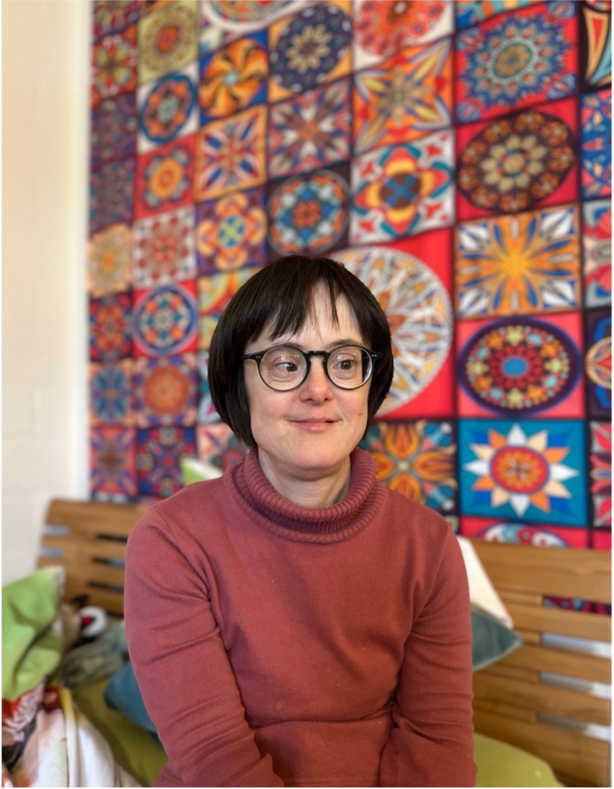
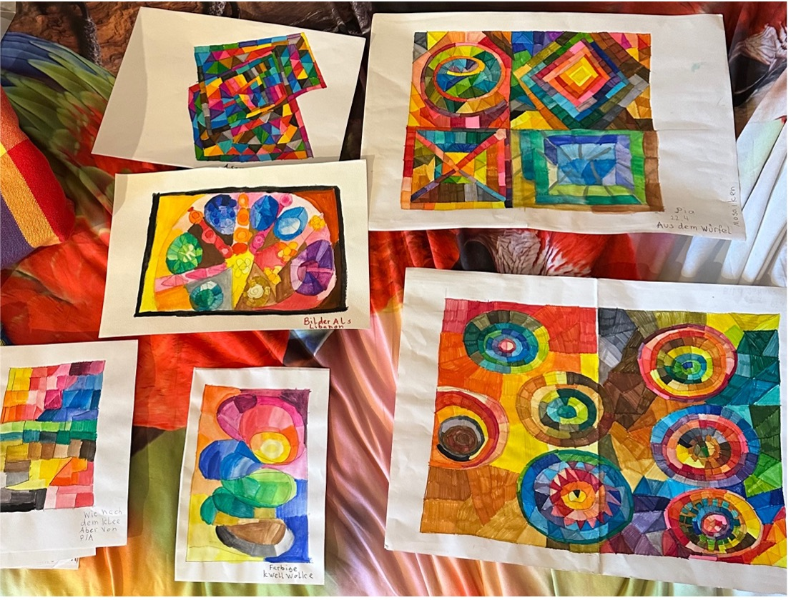

+++
title = "Trisomie"
date = "2024-04-26"
draft = false
pinned = false
+++
# Trisomie 21: Mehr als nur ein genetischer Zustand eine Feier der Individualität



Die genetische Störung bekannt als ,,Down-Syndrom’’ kennt mittlerweile die Mehrheit der Bevölkerung. Jedoch werden die Menschen mit Trisomie 21 oft noch von der Gesellschaft ausgegrenzt. 



*Eine Reportage von Abseera Nanthakumar und Célestine Pfeuti*

Im Aufenthaltsraum des Wohnheims Acherli stehen rote, bequeme Sofas und ein mit Herzen geschmückter Baum für den Valentinstag, es herrscht eine warme Stimmung. Die Frau im Sekretariat teilt mit, dass die Interviewpartnerin gleich kommen solle. Einige Sekunden später treffen Olivier, ein Betreuer im Wohnheim, und Pia, die Interviewpartnerin und zudem Bewohnerin ein. Nach der Begrüssung geht Olivier vor und zeigt den Weg bis zum Aufzug. Im Aufzug sind alle Stöcke mit farbigen Stickern beklebt. Pia drückt auf den 2. Stock mit dem blauen Sticker drauf. ,,Pikettzimmer’’, so ist das Zimmer angeschrieben, bei dem Olivier die Tür offenhält.

## Wohnheim Acherli

Das Wohnheim Acherli, im Tscharnergut in Bern gelegen, gibt es bereits seit 30 Jahren. Es ist ein Wohnheim für Menschen mit einem Handicap. Auf der Homepage der Institution ist zu lesen, dass das Acherli Bewohner\*innen auf 12 Wohngruppen sowie drei Aussenwohngruppen und individuelle Betreuung, Begleitung, Förderung und Beratung anbietet. In den Wohngruppen werden alle Handicaps einzeln berücksichtigt. Die Wohngruppen sind gemütlich und einladend gestaltet. Es gibt eine grosse, senfgelbe Küche mit grosser Metallwand, an der Bilder der WG-Bewohner\*innen aufgehängt sind. Als Orientierungshilfe dienen liebevoll angebrachte farbige Sticker. Zudem gibt es Essensbilder, die an Magnetknöpfen geklebt sind. Wenn die Knöpfe gedrückt werden, ist eine weibliche Stimme zu hören: » Für Person XY gibt es heute Fleischbällchen mit Kartoffeln zum Mittagessen’’. Gemäss Olivier werden die Aufnahmen täglich neu aufgenommen. Für die Künstler*innen im Wohnheim gibt es zudem ein Atelier, mit der Möglichkeit Bilder auszustellen. Die Kunstwerke können zudem zwei Mal pro Jahr am Acherli-Märit zum Kauf angeboten werden. 

## Schauen dich Leute manchmal komisch an? ,, Ja manchmal, aber ich mach mir nichts draus.’’

Nach einem Rundgang durchs Wohnheim Acherli wird Pia im ,,Pikettzimmer’’ interviewt. Olivier erzählt, dass das Zimmer nachts für die Bewohner*innen immer zugänglich ist. ,,Es ist wie ein Nachtdienst, jedoch mit der Möglichkeit zu schlafen’’. Das Interview beginnt. Pia Magdalena Heim ist 45 Jahre alt und Künstlerin. Bevor sie ins Wohnheim kam, ging sie immer wieder zu ihren Eltern nach Hause leben. Als sie ins Acherli kam, kannte sie hier schon Olivier. Die Eltern von Pia leben nicht mehr. Pias Mutter erlitt 2022 eine zweite tödliche Hirnblutung. Ihr Vater starb an Leukämie, als sie 12 Jahre alt war. Sie habe zudem zwei Geschwister. Ihre Schwester heirate schon bald, erzählt sie stolz. Pia hat vor ein paar Jahren eine Lehre als Hauswirtschaftsangestellte begonnen. Jedoch konnte sie diese leider nicht fertig machen, da sie an Diabetes Typ-1 leidet. Bei Menschen mit Down-Syndrom ist das Risiko an Diabetes zu erkranken um das Dreifache erhöht. Die Diagnose hinderte sie daran, Sachen zu erledigen, da ihre Zuckerwerte teilweise niedrig waren. Nun konzentriere sie sich auf die Kunst. Pia fügt an, sie habe als Kleinkind schon eine eigene Staffelei gehabt und gerne gemalt. Sie erzählt, dass sie keinen bestimmten Malstil habe, sie zeichne aus dem Kopf, was ihr gerade in den Sinn komme. Im dritten Stock angekommen zeigt Pia uns ihr Zimmer. An ihrer Zimmertür hängt ein Bild ihrer Familie. Es ist eine wohlige Aura zu spüren. Sehr viele warme Farben und ein Tuch über Pias Bett lassen das Zimmer «heimelig» wirken. Pia greift unters Bett und zeigt ihre prachtvollen Kunstwerke, die genauso farbenfroh sind wie ihr Zimmer.

## Was passiert mit den Chromosomen bei Trisomie 21?

 Genetik

Die DNA besteht aus zwei Ketten von Nukleotiden. Ein Nukleotid setzt sich aus Phosphat, Zucker und vier verschiedenen Basen zusammen. Die DNA hat eine Struktur, die als Doppelhelix bezeichnet wird. Die Gene prägen die Merkmale aus und sind die Baupläne, die Proteine erzeugen, welche wiederum Merkmale bestimmen. Wenn Gene beispielsweise für Proteine codieren, die viel Melanin produzieren, resultiert dies in brauner Haarfarbe. Die Gene sind Abschnitte auf der DNA, von denen sich etwa 25.000 auf unserer DNA befinden. Gene zusammen bilden das Genom oder die Gesamtheit aller Chromosomen in einer Zelle. Ein Chromosom besteht aus zwei Chromatiden, was bedeutet, dass ein Chromatid eine aufgewickelte DNA ist. Die DNA wickelt sich um Histone (Proteine), und dieser Wicklungsprozess wiederholt sich, bis ein Chromosom entsteht. In einer menschlichen Körperzelle befinden sich 46 Chromosomen, was 23 Chromosomenpaaren entspricht. Die Hälfte der Chromosomen, also 23, werden von der Mutter und die anderen vom Vater vererbt. 



Laut der Webseite Kinder- & Jugendärzte im Netz wurde erst 1959 von französischen Wissenschaftlern entdeckt, dass Menschen mit Down-Syndrom 47 Chromosomen anstelle der üblichen 46 besitzen und das Chromosom 21 dreifach vorhanden ist. Dieser Fehler tritt während der Bildung von Keimzellen auf, wenn eine fehlerhafte Meiose dazu führt, dass Keimzellen das Chromosom 21 zweimal enthalten und somit 24 Chromosomen haben. Bei der Befruchtung einer solchen Keimzelle mit einer normalen entsteht ein Kind mit Trisomie 21, das 47 Chromosomen hat. Es gibt verschiedene Formen der Trisomie 21, die auftreten können. Die freie Trisomie 21 ist die häufigste und tritt bei 95% der Menschen mit Down-Syndrom auf. Daneben gibt es das Mosaik-Trisomie 21, das nur in 1-2% der Fälle vorkommt. Sehr selten ist die partielle Trisomie 21, von der weltweit 100 Fälle bekannt sind. In 3-4% der Fälle liegt eine Translokations-Trisomie 21 vor.

Die Trisomie 21 wird oft mit Hör- und Sehstörungen begleitet, welche bei Kindern häufig zu Kommunikationsschwierigkeiten führt. Zudem sind Herzerkrankungen und Verdauungsstörungen üblich. Kinder mit Trisomie 21 leiden oft an Zöliakie und Autoimmunerkrankungen wie Typ-1-Diabetes. Infektionen der Atemwege sind ebenfalls häufig aufgrund eines unterentwickelten Immunsystems. Leukämie tritt bei Betroffenen häufiger auf, und sie können auch unter Schlafapnoe leiden, einer Störung, die während des Schlafs zu wiederholten, kurzen Atemaussetzern führt. Psychiatrische Erkrankungen wie Hyperaktivität, Zwangsstörungen und Angststörungen werden bei diesen Kindern oft diagnostiziert.

## Hippotherapie

In der Physiotherapie ist die Hippotherapie (HTK) ein spezialisierter Bereich. Die Durchführung erfolgt in Kooperation mit einem Pferd. Es ist eine medizinisch Behandlungsmassnahme, die die Übertragung von Pferdebewegungen auf den Patienten verwendet. Der Patient wird durch die Bewegung des Pferdes unterstützt und bewegt sich mit ihm. Er wirkt sich nicht aktiv auf das Pferd aus. "Die HTK ist somit kein Reiten, auch kein therapeutisches Reiten", äussert Brigitte Hofstetter. Die Bewegungen, welche konstant, dreidimensional und in einem Rhythmus erfolgen, haben positive Auswirkungen, darunter die Lockerung der Muskulatur, Gleichgewicht und Koordination. Das Trainieren der Körpersymmetrie, die Stärkung der Muskulatur und die Förderung der Rumpfstabilität ist insbesondere bei Trisomie 21 ein zentrales Ziel. Physiotherapeutin der Neurologischen Klinik Basel, Ursula Künzler, absolvierte in England Einsicht bei einem Reitbetrieb sogenannt "Riding for disabled" und entwickelte eine Therapie und erhielt die offizielle Anerkennung. Die HTK ist für Junge wie auch für Erwachsene geeignet, aber vor allem für Patienten mit angeborenen Bewegungsstörungen, jedoch profitieren auch Patienten mit Hemiparesen von der Hippotherapie. Laut Brigitte wird die HTK bei Trisomie 21 von der Invalidensicherung bezahlt. Rezeptiert wird die Therapie vom Kinderarzt, Neurologen oder Hausarzt und die Zahlung wird von der Krankenkasse übernommen. "Aber jede Therapiestunde wirkt immer sofort", erklärt Frau Hofstetter. Aufgrund der kognitiven Beeinträchtigung von Kindern mit Trisomie 21 ist es oft schwierig, eine regelmässige Physiotherapie durchzuführen. In diesem Zusammenhang hat das Pferd eine wichtige Funktion als Motivator, da es die Kinder anregt, begeistert und aktiv macht. Auf diese Weise wird die Therapie zu einer angenehmen Erfahrung, in der die Kinder auch, wenn sie dem Pferd nicht entfliehen können, erfolgreich sein werden.

 Brigitte Hofstetter

Die 56-jährige Brigitte Hofstetter arbeitet seit 15 Jahren im Therapiehof Schwand, wobei sie mit Islandpferden zusammenarbeitet und verantwortlich ist, die Klienten mit der Bewegung, sowie das Auf- und Absteigen auf der Rampe zu helfen. Sie ist eine selbstständige Physiotherapeutin und hat ihre eigene Praxis. Als eine Physiokollegin erzählte, dass sie als Hippotherapeutin tätig sei, prüfte sie zunächst, ob sie die zusätzliche Anforderung erfüllte, und absolvierte daraufhin die Ausbildung. 



### *,,Beim Umgang mit dem Pferd sind viele sehr vorsichtig und lieben es mit dem Pferd zu schmusen.’’*

Sie berichtet, dass sie ihren Beruf liebt, sowohl die Arbeit in der Praxis als auch die Hippotherapie. Dabei steht der Mensch im Mittelpunkt. Die Hippotherapie ermöglicht es ihr, ihren Beruf mit ihrem Hobby zu verbinden. Sie betont die körperliche Anstrengung und dass sie bei jedem Wetter draussen ist. Sie erwähnt, dass sie sehr fröhliche, herzliche Menschen mit einer Vielfalt an Talenten sind. Von den Kindern, die betreut werden, singen die meisten, zum Beispiel wenn sie im Wald unterwegs sind.